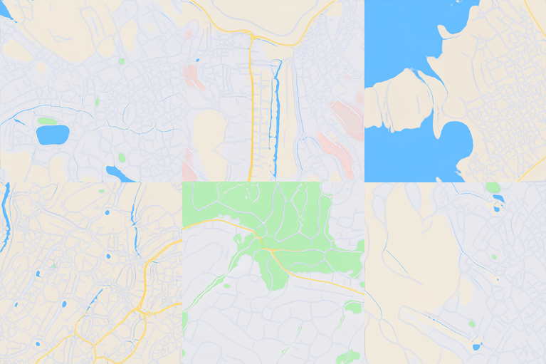
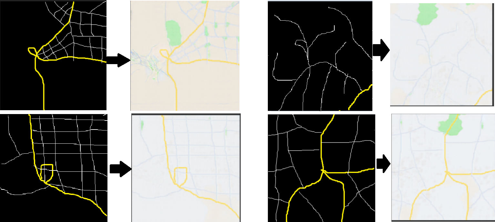

# Procedural City Generation with GANs

A procedural city generator using generative adversarial networks. The main generator was trained using
Nvidia's [StyleGAN2](https://github.com/NVlabs/stylegan2).



This library also provides a Pix2Pix GAN that is capable of generating a realistic map given an input image
representing road networks.



## Requirements

This library has been successfully tested with the following versions:
* Python 3.7.7
* CUDA Toolkit 10.0.130
* cuDNN 7.6.5

However, meeting the below minimum requirements should suffice.
* Python 3.6 or 3.7
* CUDA Toolkit >= 10.0
  * An NVIDIA graphics card with support for CUDA >= 10.0
  Please see the following page to determine if your card is supported:
  https://developer.nvidia.com/cuda-gpus#compute
* cuDNN >= 7.6.5

## Setup

In order to successfully clone this repository, Git LFS is required.
After installing Git LFS and cloning this repository, run `git lfs pull`
in order to ensure that the models are successfully downloaded.

### Linux
1. Install CUDA: `sudo apt install nvidia-cuda-toolkit`
2. Create a new conda environment: `conda create -n citygan python=3.7`
3. Activate it: `conda activate citygan`
4. Install the framework dependencies: `conda install --file=requirements.txt`

### Windows
1. Install Python 3.6 or 3.7
2. Install [CUDA 10.0](https://developer.nvidia.com/cuda-10.0-download-archive)
3. Install requirements.txt

## Usage

### Generating a map
```python
from citygan.citygan import CityGan 

city_gan = CityGan()
city_map = city_gan.generate_map()
```

## GUI


This library comes with a GUI demonstrating features of the library. Simply run `gui.py` after performing the relevant setup steps listed below.

### Linux Setup

1. `sudo apt install python3-gi python3-gi-cairo gir.12-gtk-3.0 libgirepository1.0-dev gcc libcairo2-dev pkg-config python3-dev`
2. Install dependencies: `conda install -c conda-forge pygobject pycairo gtk3`


### Windows Setup
If on Windows, installing GTK via instructions provided here https://www.gtk.org/docs/installations/windows should be sufficient along with installing pycairo and PyGObject from pip.

Full documentation on installing PyGObject can be found here: https://pygobject.readthedocs.io/en/latest/getting_started.html

## GAN Models

The developer generated GAN files are included in the github repository, but not in the PyPi Package.
If you downloaded from PyPi you must also download the model files. The pix2pix model can be found [here](https://github.com/ProjectCity-Group/gan-cities/blob/master/citygan/models/pix2pix_citygen.h5?raw=true) and the CityGan model can be found [here](https://github.com/ProjectCity-Group/gan-cities/tree/master/citygan/models/citygan). The file structure should match what you see in the git repository.
